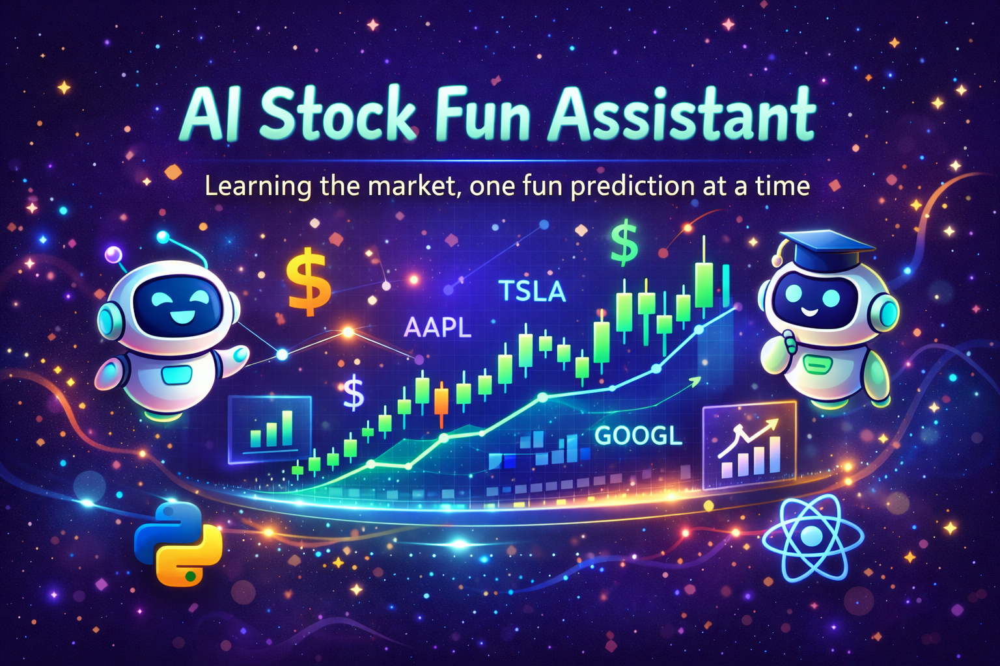

# 🚀 AI Stock Analysis Assistant

<div align="center">



**Real-time Market Intelligence Powered by Advanced AI**

[](https://www.python.org/)
[](https://fastapi.tiangolo.com/)
[](https://reactjs.org/)
[](https://github.com/langchain-ai/langgraph)
[](LICENSE)

[Features](#-features) • [Quick Start](#-quick-start) • [Architecture](#-architecture) • [API](#-api) • [Roadmap](#-roadmap)

</div>

---

## 🎯 What is This?

An intelligent conversational assistant that analyzes stocks in real-time using GPT-5, provides market insights, and helps you make informed investment decisions through natural language interactions.

## ✨ Features

🤖 **AI-Powered Analysis** - Leverages GPT-5 for sophisticated market interpretation  
📊 **Real-time Data** - Live stock prices and market data via Yahoo Finance  
💬 **Conversational UI** - Chat naturally about stocks, no commands needed  
🔄 **Streaming Responses** - Real-time token-by-token response generation  
🧠 **Memory Persistence** - Maintains conversation context across sessions  
🎨 **Modern Interface** - Sleek React frontend with responsive design  
⚡ **Lightning Fast** - Built on FastAPI for maximum performance  

## 🏗️ Architecture

```
┌─────────────────┐      ┌──────────────────┐      ┌─────────────────┐
│   React Client  │ WSS  │  FastAPI Server  │ LLM  │   GPT-5 API     │
│   (Frontend)    │◄────►│   (Backend)      │◄────►│   (TheSys)      │
└─────────────────┘      └──────────────────┘      └─────────────────┘
                                 │                           
                                 ▼                           
                         ┌───────────────┐                  
                         │  LangGraph    │                  
                         │  Agent + Tools│                  
                         └───────────────┘                  
                                 │                           
                                 ▼                           
                         ┌───────────────┐                  
                         │ Yahoo Finance │                  
                         │    yfinance   │                  
                         └───────────────┘                  
```

## 🚀 Quick Start

### Prerequisites

- Python 3.12+
- Node.js 18+
- OpenAI API Key (via TheSys)

### Backend Setup

```bash
# Clone the repository
git clone https://github.com/yourusername/ai-stock-assistant.git
cd ai-stock-assistant/backend

# Create virtual environment
python -m venv .venv
source .venv/bin/activate  # Windows: .venv\Scripts\activate

# Install dependencies
pip install fastapi uvicorn langchain-openai langgraph yfinance python-dotenv

# Configure environment
echo "OPENAI_API_KEY=your_api_key_here" > .env

# Run server
python main.py
```

### Frontend Setup

```bash
cd ../frontend

# Install dependencies
npm install

# Start development server
npm run dev
```

Visit `http://localhost:5173` and start chatting! 🎉

## 📡 API Reference

### POST `/api/chat`

Stream AI responses for stock analysis queries.

**Request:**
```json
{
  "prompt": {
    "id": "uuid",
    "role": "user",
    "content": "What's Tesla's current stock price?"
  },
  "threadId": "conversation-uuid",
  "responseId": "response-uuid"
}
```

**Response:** Server-Sent Events (SSE)
```
data: Tesla (TSLA) is currently trading at $...
data: The stock has shown strong momentum...
```

## 🛠️ Tech Stack

| Layer | Technology |
|-------|-----------|
| **AI/LLM** | GPT-5 via TheSys API |
| **Agent Framework** | LangGraph + LangChain |
| **Backend** | FastAPI + Python 3.12 |
| **Frontend** | React 18 + TypeScript |
| **Data Source** | Yahoo Finance (yfinance) |
| **Streaming** | Server-Sent Events (SSE) |
| **Memory** | LangGraph MemorySaver |

## 🎨 Features in Detail

### Conversational Memory
Uses LangGraph's built-in checkpointing to maintain conversation history, allowing follow-up questions without context loss.

### Real-time Streaming
FastAPI's `StreamingResponse` delivers AI responses token-by-token for a ChatGPT-like experience.

### Extensible Tool System
Easily add new tools for fundamental analysis, technical indicators, news sentiment, and more:

```python
@tool
def get_stock_price(symbol: str) -> str:
    """Get current stock price"""
    stock = yf.Ticker(symbol)
    return f"Current price: ${stock.info['currentPrice']}"
```

## 🗺️ Roadmap

- [x] Basic conversational interface
- [x] Real-time stock price queries
- [x] Streaming responses
- [ ] Technical analysis tools (RSI, MACD, Bollinger Bands)
- [ ] Fundamental analysis (P/E, EPS, Market Cap)
- [ ] News sentiment analysis
- [ ] Portfolio tracking
- [ ] Price alerts & notifications
- [ ] Multi-stock comparison
- [ ] Export conversation reports

## 🤝 Contributing

Contributions are welcome! Feel free to:

1. Fork the repository
2. Create a feature branch (`git checkout -b feature/amazing-feature`)
3. Commit changes (`git commit -m 'Add amazing feature'`)
4. Push to branch (`git push origin feature/amazing-feature`)
5. Open a Pull Request

## 📄 License

MIT License - see [LICENSE](LICENSE) for details.

## 💡 Pro Tips

- Use specific stock symbols (AAPL, TSLA) for accurate results
- Ask follow-up questions to dive deeper into analysis
- Request comparisons between multiple stocks
- Ask for historical data and trends

## 🙏 Acknowledgments

- [LangChain](https://github.com/langchain-ai/langchain) - AI orchestration framework
- [FastAPI](https://fastapi.tiangolo.com/) - Modern Python web framework
- [yfinance](https://github.com/ranaroussi/yfinance) - Yahoo Finance data library

---

<div align="center">

**Built with ❤️ by [Your Name]**

[⬆ Back to Top](#-ai-stock-analysis-assistant)

</div>